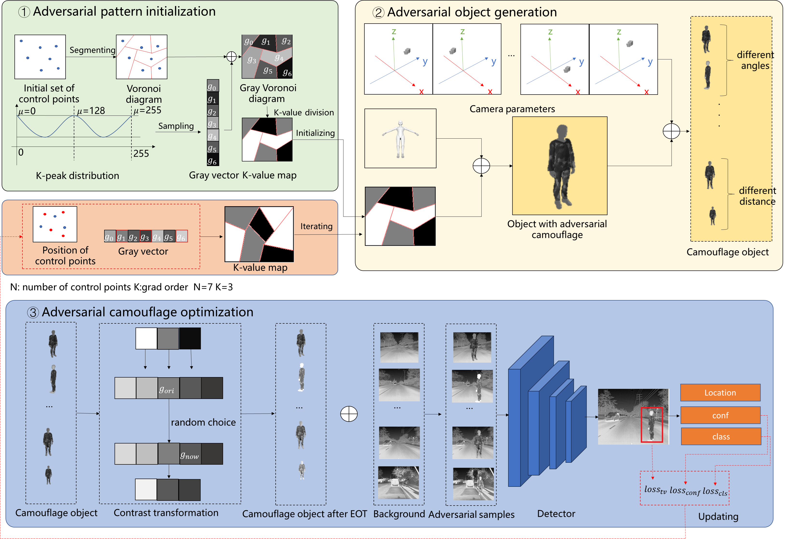

## NightWalker: Robust Multi-view Infrared Adversarial Attack with Physically Realizable Camouflage via Voronoi Diagrams

## Abstract
Thermal infrared object detection based on deep neural networks (DNNs) is widely used for safety-critical tasks in dark scenes, but exhibits misbehavior and even results in irreversible disasters. Therefore, it is crucial to estimate the vulnerability of DNN-based thermal infrared systems and improve their security. The adversarial attack based on physically realizable camouflage is one of the most appealing ways to identify their vulnerability, which crafts adversarial patches adding to the object to fool DNN-based thermal infrared systems into being blind. However, existing attacks are still limited from three aspects: viewing restriction, transformation loss, and attention-grabbing. To address these issues, we propose NightWalker, a new physical infrared camouflage framework that differs from previous works: (1) multi-view - it alleviates the viewing restriction in physical domain through 3D-to-2D projection loss optimization based on Voronoi diagrams; (2) robustness - it degrades the transformation loss from the digital to the physical domain by developing Expectation Over Transformation for infrared contrast; (3) stealthiness - it avoids attention-grabbing in visible and infrared scenes through color smoothing and emissivity-controllable materials automatic determination. Extensive evaluations across 3 datasets, 8 detectors, and 10 materials demonstrate NightWalker’s superior performance against 8 baselines in 50 subjects The demos are available at this page.

[Display of physical adversarial camouflage in RGB images](#visible) 

### Physical adversarial camouflage in RGB images.
<table border="1">
    <tr>
        <td>
<video width="330" height="170" controls>
  <source src="VIS\smallbulb.mp4" type="video/mp4">
  Your browser does not support the video tag.
</video>
<figcaption>BulbAttack</figcaption>
        </td>
        <td>
<video  width="330" height="170" controls>
  <source src="VIS\AIP.mp4" type="video/mp4">
  Your browser does not support the video tag.
</video>
<figcaption>AIP</figcaption>
        </td>
        <td>
<video  width="330" height="170" controls>
  <source src="VIS\Hotcold.mp4" type="video/mp4">
  Your browser does not support the video tag.
</video>
<figcaption>HotColdBlock</figcaption>
        </td>
    </tr>
    <tr>
        <td>
<video  width="330" height="170" controls>
  <source src="VIS\UAP.mp4" type="video/mp4">
  Your browser does not support the video tag.
</video>
<figcaption>UAP</figcaption>
        </td>
        <td>
<video  width="330" height="170" controls>
  <source src="VIS\AIB.mp4" type="video/mp4">
  Your browser does not support the video tag.
</video>
<figcaption>AIB</figcaption>
        </td>
        <td>
<video  width="330" height="170" controls>
  <source src="VIS\ADVSticker.mp4" type="video/mp4">
  Your browser does not support the video tag.
</video>
<figcaption>ADVSticker</figcaption>
        </td>
    </tr>
<video  width="330" height="170" controls>
  <source src="VIS\QRCode.mp4" type="video/mp4">
  Your browser does not support the video tag.
</video>
<figcaption>QRAttack</figcaption>
        </td>
    </tr>
<video  width="330" height="170" controls>
  <source src="VIS\NightWalker.mp4" type="video/mp4">
  Your browser does not support the video tag.
</video>
<figcaption>NightWalker</figcaption>
        </td>
    </tr>
</table>

